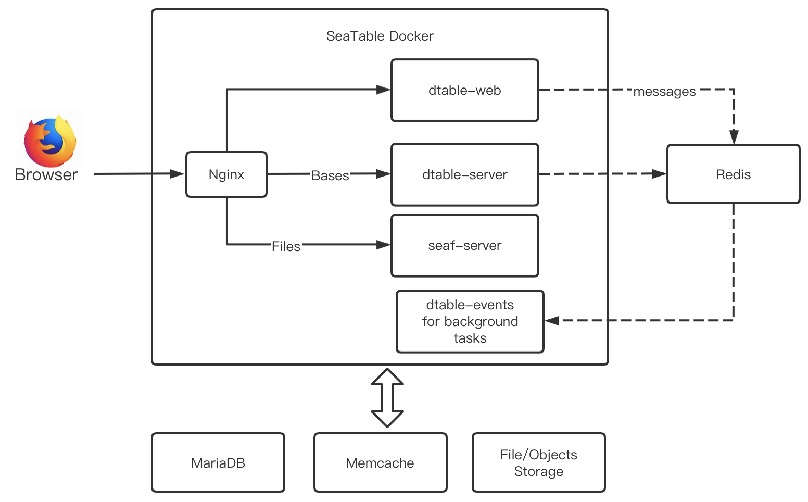

# Introduction

SeaTable is an online lightweight database with a spreadsheet interface. It helps you to easily record and manage all kinds of scattered information. With APIs and SDKs, you can quickly scale to your needs, automate data processing and automate business processes.

Main features includes:

* A spreadsheet like interface to records data supporting collaboratively editing.
* A form app to collect data from outside.
* Mobile ready UI to be used on browsers in mobile system to view and collect data.
* Comprehensive API and SDK for adding extensions.
* Filters, sorts, charts and pivotal tables to visualize and analyze data.

## Software components

SeaTable consists of following component

* dtable-web: The web site for manage tables.
* dtable-server: Store the tables and provide collaborating feature.
* dtable-events: Background tasks likes email sending and so on.
* seaf-server: Store attachments (files and images)

The following picture shows how the different components work together:

Some explanation:

* MariaDB, Memcache, Redis are running in their own docker containers.
* ccnet-server is currently only used for query users/groups from database, which will be merged into seaf-server.
* Redis is used for sending messages from dtable-web/dtable-server to dtable-events
* All the components use Memcache for storing cache and MariaDB for storing permanent information
* Bases are maintained in dtable-server and periodically saved to file/objects storage for persistent storage.
* Attachments are saved in file/objects storage

## LICENSE

SeaTable has three versions

* Developer edition: for users that want to use SeaTable as database and heavy using APIs and scripts.  The developer edition has no limit on storage, row numbers and API calls, but can support at most 200 concurrent connections to dtable-server.
* Cloud edition: for users that want to use SeaTable as a collaboration tool. It has limitation for storage, row numbers and API calls.
* Enterprise edition: almost no limitation for storage, row numbers and API calls and have advanced permissions and user management features. It is meant for large teams to use SeaTable in both way. Users can use it in the cloud or self-hosted.

The different components of SeaTable developer edition are released under different licenses:

* dtable-web: Apache License v2
* dtable-events: Apache License v2
* dtable-server: [Proprietary License](dtable-server-license.md)
* seaf-server: AGPLv3

SeaTabe developer edition should not be used to provide SaaS service or as a part of your SaaS service. Other kinds of usage are okay, including

* Use it internally in your company.
* Personal or home use.
* Use it to collaborate with your customers.
* Use it for IT projects for your customers, as long as you use a separate server for each of your customers.

The SeaTable enterprise edition is released under proprietary license.

## Report issues

Please report issues to our forum <https://forum.seatable.io/>

## More information

* GitHub: <https://github.com/seatable/seatable>

